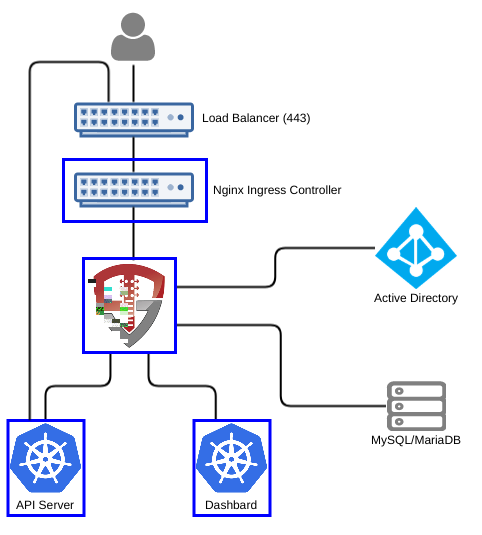

# Kubernetes Identity Manager

This quick start for OpenUnison is designed to provide an identity management hub for Kubernetes that will:

1. Provide an OpenID Connect Bridge for SAML2, multiple LDAP directories, add compliance acknowledgment, etc
2. Self service portal for requesting access to and getting approval for individual projects
3. Self service requests for gaining cluster level roles
4. Support removing users' access
5. Reporting

The quick start can run inside of Kubernetes, leveraging Kubernetes for scalability and secret management.  It can also be run externally to Kubernetes.  This guide assumes you intend to run OpenUnison inside of Kubernetes.



The OpenUnison deployment stores all Kubernetes access information as a groups inside of a relational database, as opposed to a group in an external directory.  OpenUnison will create the approprioate Roles and RoleBindings to allow for the access.

# Roles Supported

## Cluster

1.  Administration - Full cluster management access

## Namespace

1.  Administrators - All operations inside of a namespace
2.  Viewers - Can view contents of a namespace, but can not make changes

## Non-Kubernetes

1.  System Approver - Able to approve access to roles specific to OpenUnison
2.  Auditor - Able to view audit reports, but not request projects or approve access

# Deployment

The deployment model assumes:
1. Kubernetes 1.8 or higher (tested with "stock" Kubernetes, but should work with any Kubernetes distribution)
2. An image repository
3. Access to a certified RDBMS (may run on Kubernetes)

These instructions cover using the Source-to-Image created by Tremolo Security for OpenUnison, but can be deployed into any J2EE container like tomcat, wildfly, etc.  The Source-to-Image builder will build a container image from your unison.xml and myvd.props file that has all of your libraries running on Undertow.io on the latest CentOS.  The keystore required for deployment will be stored as a secret in Kubernetes.

## Generating Keystore

OpenUnison encrypts or signs everything that leaves it such as JWTs, workflow requests, session cookies, etc. To do this, we need to create a Java keystore that can be used to store these keys as well as the certificates used for TLS by Undertow. When working with Kubernetes something to take note of is Go does NOT work with self signed certificates that are not marked as CA:TRUE no matter how many ways you trust it. In order to use a self signed certificate you have to create a self signed certificate authority and THEN create a certificate signed by that CA. This can be done using Java's keytool but OpenSSL's approach is easier. To make this easier, the makecerts.sh script in this repository (`src/main/bash/makessl.sh`) (adapted from a similar script from CoreOS) will do this for you. Just make sure to change the subject in the script first:

```bash
$ sh makessl.sh
$ cd ssl
$ openssl pkcs12 -export -chain -inkey key.pem -in cert.pem -CAfile ca.pem -out openunison.p12
$ cd ..
$ keytool -importkeystore -srckeystore ./ssl/openunison.p12 -srcstoretype PKCS12 -alias 1 -destKeystore ./unisonKeyStore.jks -deststoretype JCEKS -destalias unison-tls
```

```bash
$ keytool -genseckey -alias session-unison -keyalg AES -keysize 256 -storetype JCEKS -keystore ./unisonKeyStore.jks
$ keytool -genseckey -alias lastmile-oidc -keyalg AES -keysize 256 -storetype JCEKS -keystore ./unisonKeyStore.jks

```

Then the SAML2 RP certificate
```bash
$ keytool -genkeypair -storetype JCEKS -alias unison-saml2-rp-sig -keyalg RSA -keysize 2048 -sigalg SHA256withRSA -keystore  ./unisonKeyStore.jks -validity 3650
```

Import the SAML2 signing certificate from your identity provider
```bash
$ keytool -import -trustcacerts -alias idp-saml2-sig -rfc -storetype JCEKS -keystore ./unisonKeyStore.jks -file /path/to/certificate.pem
```

Import the trusted certificate for Kubernetes by looking for the certificate the master (Kubernetes API) server runs under.  This will depend on how you deployed Kubernetes.  For instance for kubeadm import the certificate from `/etc/kubernetes/pki/ca.crt`:
```bash
$ keytool -import -trustcacerts -alias openshift-master -rfc -storetype JCEKS -keystore ./unisonKeyStore.jks -file /path/to/ca.crt
```  


## Create Kubernetes Service Account

The easiest way to create this account is to login to the OpenShift master to run oadm and oc (these instructions from OpenUnison's product manual):

```bash
$ kubectl create serviceaccount openunison
$ kubectl describe serviceaccount openunison
$ kubectl describe secret openunison-token-xxxx
```

In the above example, XXXX is the id of one of the tokens generated in the `Tokens` section of the output from the `kubectl describe serviceaccount openunison`.  The final command will output a large, base64 encoded token.  This token is what OpenUnison will use to communicate with Kubernetes.  Hold on to this value for the next step.

## Create Roles and RoleBindings

Once the service account is created, a RoleBinding giving it access to Kubernetes needs to be created.  Additionally, Roles and RoleBindings need to be created that will grant users with cluster administration access able to manage Kubernetes.

```bash
$ cat <<EOF | kubectl create -f -
kind: ClusterRoleBinding
apiVersion: rbac.authorization.k8s.io/v1
metadata:
  name: openunison-cluster-administrators
subjects:
- kind: Group
  name: k8s-cluster-administrators
  apiGroup: rbac.authorization.k8s.io
- kind: ServiceAccount
  name: openunison
  namespace: default
roleRef:
  kind: ClusterRole
  name: cluster-admin
  apiGroup: rbac.authorization.k8s.io
EOF

$ cat <<EOF | kubectl create -f -
kind: ClusterRole
apiVersion: rbac.authorization.k8s.io/v1
metadata:
  name: list-namespaces
rules:
- apiGroups:
  - ""
  resources:
  - namespaces
  verbs:
  - list
EOF


$ cat <<EOF | kubectl create -f -
kind: ClusterRoleBinding
apiVersion: rbac.authorization.k8s.io/v1
metadata:
  name: openunison-cluster-list-namespaces
subjects:
- kind: Group
  name: users
  apiGroup: rbac.authorization.k8s.io
roleRef:
  kind: ClusterRole
  name: list-namespaces
  apiGroup: rbac.authorization.k8s.io
EOF
```
The first RoleBinding allows for our service account and for users with the `k8s-cluster-administrators` group to be members of the `cluster-admin` role.  The next two objects create a simple role and binding that will let any user from OpenUnison list the namespaces.  This is needed for the dashboard to function properly.

## Create Environments File

OpenUnison stores environment specific information, such as host names, passwords, etc, in a properties file that will then be loaded by OpenUnison.  This file will be stored in OpenShift as a secret then accessed by OpenUnison on startup to fill in the `#[]` parameters in `unison.xml` and `myvd.conf`.  For instance the parameter `#[OU_HOST]` in `unison.xml` would have an entry in this file.  Below is an example file, this file should be saved as `ou.env`:

```properties
OU_HOST=openunison.tslocal.lan
OU_HIBERNATE_DIALECT=org.hibernate.dialect.MySQL5InnoDBDialect
OU_JDBC_DRIVER=com.mysql.jdbc.Driver
OU_JDBC_URL=jdbc:mysql://192.168.56.1:3306/unison
OU_JDBC_USER=root
OU_JDBC_PASSWORD=start123
SMTP_HOST=smtp.gmail.com
SMTP_PORT=587
SMTP_USER=something@gmail.com
SMTP_PASSWORD=XXXXXXX
SMTP_FROM=something@gmail.com
SMTP_TLS=true
OU_JDBC_VALIDATION=SELECT 1
K8S_URL=https://kubernetes.default.svc:6443
K8S_TOKEN=eyJhbGciOiJS...
unisonKeystorePassword=start123
IDP_POST=https://adfs.ent2k16.domain.com/adfs/ls/
IDP_REDIR=https://adfs.ent2k16.domain.com/adfs/ls/
IDP_LOGOUT=https://adfs.ent2k16.domain.com/adfs/ls/
IDP_ENTITY_ID=http://adfs.ent2k16.domain.com/adfs/services/trust
K8S_DASHBOARD_URL=https://192.168.56.100:30443
K8S_DASHBOARD_HOST=k8sdb.tslocal.lan
K8S_DHASBOARD_LINK=https://k8sdb.tslocal.lan/
OU_COOKIE_DOMAIN=tslocal.lan
```

A few notes about the above properties:

1. The Kubernetes dashboard needs its own host name, seperate from OpenUnison.  This DNS name should point to OpenUnison (or the load balancer in front of OpenUnison)
2.  Include the token you generated earlier for the openunison service account


## Export SAML2 Metadata

Once your environment file is built, metadata can be generated for your identity provider.  First download the OpenUnion utilities jar file from `https://www.tremolosecurity.com/nexus/service/local/repositories/betas/content/com/tremolosecurity/unison/openunison-util/1.0.12.beta/openunison-util-1.0.12.beta-jar-with-dependencies.jar` and run the export:

```bash
$ java -jar ./openunison-util-1.0.12.beta.jar -action export-sp-metadata -chainName enterprise_idp -unisonXMLFile /path/to/openunison-qs-openshift/src/main/webapp/WEB-INF/unison.xml -keystorePath ./unisonKeyStore.jks -envFile ./ou.env -mechanismName SAML2 -urlBase https://openunison.demo.aws
```

Make sure to replace the `-urlBase` with the URL user for accessing OpenUnison.  It should use the same host as in OU_HOST.  This command will generate XML to the console that can be copied&pasted into a file that can be submited to your identity provider.


### Configure Identity Provider

Once the OpenUnison metadata is imported, make sure the following attributes are in the assertion:

| Attribute Name | Active Directory Attribute | Description |
| -------------- | -------------------------- | ----------- |
| uid            | samAccountName             | User's login id |
| givenName      | givenName                  | User's first name |
| sn             | sn                         | User's last name |
| mail           | mail                       | User's email address |

If using Active Directory Federation Services, you can use the following claims transformation rule:
```
c:[Type == "http://schemas.microsoft.com/ws/2008/06/identity/claims/windowsaccountname", Issuer == "AD AUTHORITY"]
 => issue(store = "Active Directory", types = ("http://schemas.xmlsoap.org/ws/2005/05/identity/claims/nameidentifier", "uid", "givenName", "sn", "mail"), query = ";sAMAccountName,sAMAccountName,givenName,sn,mail;{0}", param = c.Value);
```

## Create OpenUnison YAML

OpenUnison can be configured to use specific TLS ciphers or algorithms.  Create a file called `openunison.yaml` in the same directory where you created your ou.env and unisonKeyStore.jks file using the content from the [OpenUnisonS2IDocker ReadMe](https://github.com/TremoloSecurity/OpenUnisonS2IDocker/blob/master/README.md) under the section **openunison.yaml**.  Unless you have special requirements (ie you need to allow more or fewer ciphers) you shouldn't need to make any changes.   

## Deploy OpenUnison Secret

Kubernetes stores secrets, ie passwords, keystores, etc in special volumes called Secrets.  Creating a secret involves base64 encoding your files and putting them into a YAML file, which is error prone.  To make this easier there's a script that will create the secret yaml for you so you can import it into Kubernetes in `src/main/bash`:

```bash
$ ./makesecret.sh /path/to/openunison-artifacts | kubectl create -f - -n openunison
```

## Build OpenUnison

OpenUnison is best built using the OpenUnison s2i builder.  This builder can either build OpenUnison based on an existing maven project, or it can simply deploy a war file of a pre-built OpenUnison project.  For a detailed explination of the OpenUnison build process, see OpenUnison's [deployment documentation](https://www.tremolosecurity.com/docs/tremolosecurity-docs/1.0.12/openunison/openunison-manual.html#_deploying_openunison_on_undertow).

The OpenUnison Source2Image builder will pull your project from source control, build it (integrating the basic OpenUnison libraries) and create a docker image built on OpenUnison's Undertow implementation.  This image can then be pushed to your repository and refernced in your OpenUnison Deployment.  The first step is to have Docker installed.  Then download the proper s2i build for your platform from https://github.com/openshift/source-to-image/releases, build OpenUnison, push into your repository and finally deploy to Kubernetes.

Now that the objects have been created, create a container using s2i using your OpenUnison project:

```bash
$ docker pull docker.io/tremolosecurity/openunisons2idocker:latest
$ s2i build https://github.com/TremoloSecurity/openunison-qs-kubernetes.git docker.io/tremolosecurity/openunisons2idocker:latest localhost:5000/tremolosecurity/openunison-k8s
$ docker push localhost:5000/tremolosecurity/openunison-k8s
```

Make sure to replace `localhost:5000` with the host of your Kubernetes registry.  Once the image is pushed, Now, we can create our `Deployment` and `Service`.  Edit `src/main/yaml/openunison_deployment.yaml` to suit your needs.  For instance, in the `container` `spec` edit the `image` attribute to point to the registry that is hosting your image.

```bash
$ kubectl create -f ./openunison_deployment.yaml -n openunison
```

At this point OpenUnison should begin to start.  Now we need to expose it to users so it can be accessed by creating a `Service`.  The `src/main/yaml/openunison_service.yaml` file contains a simple `Service` that will expose both an http and https port for OpenUnison.  You can either specify a specific port or allow an Ingres controller and load balancer expose OpenUnison over standard ports.

```bash
$ kubectl create -f ./openunison_service.yaml -n openunison
```

## First Login to the Kubernetes Identity Manager

At this point you should be able to login to OpenUnison using the host specified in  the `HOSTNAME_HTTPS` of the template.  Once you are logged in, logout.  Users are created in the database "just-in-time", meaning that once you login the data representing your user is created inside of the database we are pointing to in our `ou.env` file.

## Create First Administrator

The user you logged in as is currently unprivileged.  In order for other users to login and begin requesting access to projects this first user must be enabled as an approver.  Login to the MySQL database that is configured in `ou.env` and execute the following SQL:

```sql
insert into userGroups (userId,groupId) values (2,1);
```

This will add the administrator group to your user.  Logout of OpenUnison and log back in.

## Self Request & Approve Cluster Administrator

Once SSO is enabled in the next step, you'll need a cluster administrator to be able to perform cluster level operations:

1.  Login to OpenUnison
2.  Click on "Request Access" in the title bar
3.  Click on "Kubernetes Administration"
4.  Click "Add To Cart" next to "Cluster Administrator"
5.  Next to "Check Out" in the title bar you'll see a red `1`, click on "Check Out"
6.  For "Supply Reason", give a reason like "Initial user" and click "Submit Request"
7.  Since you are the only approver refresh OpenUnison, you will see a red `1` next to "Open Approvals".  Click on "Open Approvals"
8. Click "Review" next to your email address
9. Specify "Initial user" for the "Justification" and click "Approve"
10. Click on "Confirm Approval"

At this point you will be provisioned to the `k8s-cluster-administrators` group in the database that has a RoleBinding to the `cluster-admin` Role.  Logout of OpenUnison and log back in.  If you click on your email address in the upper left, you'll see that you have the Role `k8s-cluster-administrators`.  

## Enable Authentication with Kubernetes

For a generic deployment, see the [Kubernetes Authentication](https://kubernetes.io/docs/admin/authentication/#openid-connect-tokens).  If using kubeadm, update `/etc/kubernetes/manifests/kube-apiserver.yaml` with the OpenID Connect parameters:

```
- --oidc-issuer-url=https://openunison.tslocal.lan/auth/idp/k8sIdp
- --oidc-client-id=kubernetes
- --oidc-username-claim=sub
- --oidc-groups-claim=groups
- --oidc-ca-file=/etc/kubernetes/pki/ou-ca.pem
```

The issuer will point to your OpenUnison instance, the ca certificate needs to be either trusted by the servers running Kubernetes or it will need to be explicitly referenced by the API server configuration.

# Whats next?
Now you can begin mapping OpenUnison's capabilities to your business and compliance needs.  For instance you can add multi-factor authentication with TOTP or U2F, Create privileged workflows for onboarding, scheduled workflows that will deprovision users, etc.
